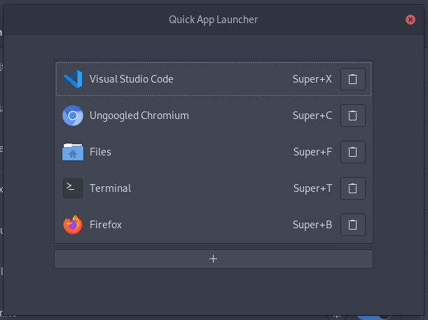

# Quick App Launcher

A GNOME extension to launch apps with keybindings. If the to-be-launched app already has a window open, focus that window instead. If the focused window is an instance of the app, open a new window. 

## Supported GNOME versions

- 3.36
- 3.38
- 40

## Installation

You can install it via https://extensions.gnome.org. Alternatively, you can download the `quick-app-launcher@leleat-on-github` folder and move it to your extensions folder. Local extensions are in `~/.local/share/gnome-shell/extensions/`. After moving the folder to the correct location, restart the GNOME shell (`Alt`+`F2`: enter `r`. On **Wayland** you need to logout).

## License

This extension is distributed under the terms of the GNU General Public License, version 2 or later. See the license file for details.
